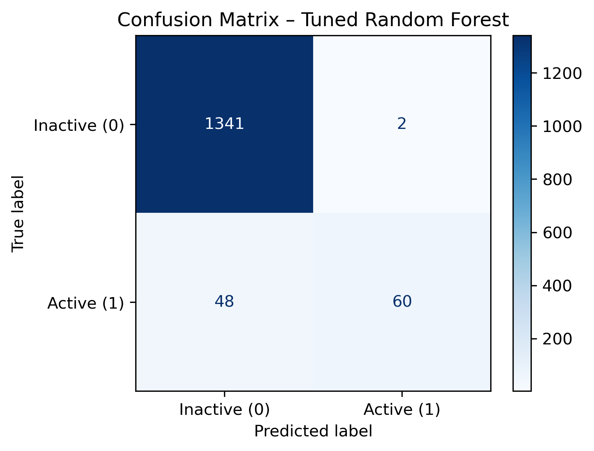

## 🧪 QSAR-Based Toxicity Prioritization for NR-AR (Tox21)

### 1. Project Overview
This project develops a QSAR-based machine learning model for predicting and
prioritizing NR-AR (Androgen Receptor) active compounds using molecular
structure alone.

Rather than treating toxicity prediction as a strict binary classification
task, the model is designed as a prioritization tool that ranks compounds by
their predicted probability of NR-AR activity, enabling effective toxicity
screening under severe class imbalance.

---

### 2. Why This Matters
NR-AR activation is a key endocrine toxicity endpoint relevant to chemical
safety assessment and regulatory toxicology.

Experimental toxicity testing is expensive and impractical for large chemical
libraries. Computational prioritization models allow:

- Early identification of high-risk compounds  
- Efficient allocation of experimental testing resources  
- Chemically realistic generalization to unseen scaffolds  

This makes QSAR-based toxicity screening a critical component of modern ADMET
pipelines.

---

### 3. Dataset (Tox21 – NR-AR)
- **Source:** Tox21 public benchmark dataset  
- **Task:** Binary toxicity endpoint (NR-AR activity)  

**Labels**
- `1` → NR-AR active (toxicologically relevant)  
- `0` → NR-AR inactive  

- **Class imbalance:** ~4% actives  

**Input representation**
- Canonical SMILES  
- RDKit-derived physicochemical descriptors  
- Morgan fingerprints (ECFP-like)  

Invalid or non-parsable SMILES were removed prior to feature generation.

---

### 4. Feature Engineering
Two complementary feature types are used:

**Continuous descriptors**
- MolWt  
- MolLogP  
- HBD  
- HBA  
- TPSA  
- Rotatable Bonds  

**Binary fingerprints**
- Morgan fingerprints  

Continuous descriptors are standardized using a scaler fitted only on the
training set, while binary fingerprints are left unscaled to preserve their
original representation.

---

### 5. Data Splitting Strategy (Critical Design Choice)
To ensure chemically realistic evaluation, a Murcko scaffold-based train/test
split is used.

- Entire scaffolds are assigned exclusively to either train or test  
- Zero scaffold overlap is enforced  
- The test set is re-generated using controlled seeds to ensure a sufficient
  number of positive samples  

This prevents information leakage from closely related analogs and reflects
real-world deployment conditions.

---

### 6. Models Evaluated
All models are evaluated using scaffold-aware cross-validation
(`GroupKFold`).

**Baseline models**
- Logistic Regression (balanced class weights)  
- Random Forest  

**Evaluation metrics**
Given the strong class imbalance, emphasis is placed on:
- PR-AUC (primary metric)  
- ROC-AUC  
- Recall and F1-score for the active class  
- Accuracy (reported for completeness)  

---

### 7. Final Model Performance (Scaffold-Held-Out Test Set)
**Random Forest (tuned via scaffold-aware CV):**

| Metric | Value |
|------|------|
| Accuracy | 0.966 |
| Precision (Active) | 0.968 |
| Recall (Active) | 0.556 |
| F1-score (Active) | 0.706 |
| ROC-AUC | 0.850 |
| PR-AUC | 0.694 |

**Confusion Matrix**

The model achieves high precision with moderate recall, reflecting a conservative screening behavior suitable for toxicity prioritization.

### 8. Prioritization & Enrichment Analysis
In contrast to traditional binary QSAR classification, this model ranks compounds
by predicted NR-AR activity probability rather than applying a hard decision
threshold.

**Top-N enrichment**
- A large fraction of active compounds is recovered within the top-ranked subset
- At low screening budgets (top 1–5%), enrichment is 10×+ better than random
  selection

This demonstrates strong early recognition performance, which is critical for
real-world toxicity screening applications.

---

### 9. Key Takeaways
- Scaffold-aware evaluation is essential for realistic QSAR toxicity assessment
- PR-AUC and enrichment metrics are more informative than accuracy under class
  imbalance
- The final model is better suited as a prioritization tool rather than a strict
  yes/no classifier
- Results are robust, leakage-free, and chemically interpretable

---

### 10. Tools & Libraries
- Python
- RDKit
- scikit-learn
- NumPy / pandas
- matplotlib

---

### Author
**Nezihe Mohiuddin**  

